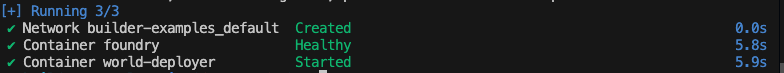

### Step 0: Installing general tools 
#### Installing Git
Install Git through https://git-scm.com/book/en/v2/Getting-Started-Installing-Git. 

To confirm Git has been installed run:
```bash
git --version
```

#### Installing NVM
Install NVM by using this command:
```bash
curl -o- https://raw.githubusercontent.com/nvm-sh/nvm/v0.35.3/install.sh | bash
```

Restart the shell to use it.

#### Installing NPM
Install version 18.12.1 of npm using node version manager with:
```bash
nvm install 18.12.1
```

#### Installing PNPM
Install PNPM version 8 with:
```bash
npm install -g pnpm@latest-8
```

### Step 0.1: Installing Foundry + Forge
Install foundry and restart the shell with:
```bash
curl -L https://foundry.paradigm.xyz | bash && source /root/.bashrc
```

Run the below command to install forge, cast, anvil and chisel:
```bash
foundryup
```

### Step 0.2: Setting up your environment:
This guide will walk you through setting up a local environment for running a local Anvil node, deploying world contracts using Docker, and pulling ABIs.

### Prerequisites
Make sure you have the **Docker** installed on your system: [Installation Guide](https://docs.docker.com/get-docker/)

### Step 0.3: Deploying world contracts into a local node.
We have provided a compose file which bundles the running of the local node and deploying the world chain contracts to simulate the existing world. Run that with the command
```bash
docker compose up -d
```


and monitor the progress of the world deployment with:

```bash
docker compose logs -f world-deployer
```

The deployment progress and relevant addresses will be displayed during the process. Once the deployment is complete, you should see an output similar to the one below. Make sure to copy the world contract address and save it for future reference.


### Step 0.2 (Optional): Retrieveing world ABIs
You can also retrieve the world abis and save them to the root directory from the deployment by running:

```bash
docker compose cp world-deployer:/monorepo/abis .
```

Now that your local development environment is set up, you're ready to start building! To begin, simply navigate to the desired example directory and follow the instructions outlined in its respective README file.

```bash
cd item-seller
cat readme.md
```