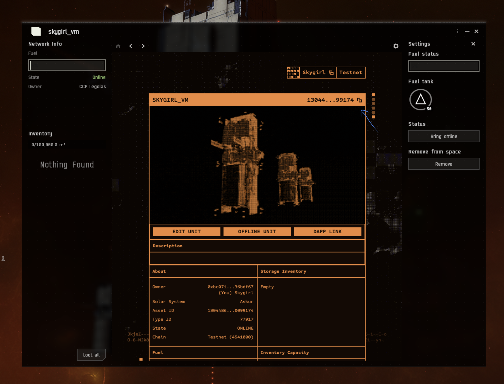

# Good Place to start 
Our work is built on [MUD](https://mud.dev/quickstart). [MUD](https://mud.dev/introduction) docs is a good place to start learning the concepts 

Thanks to the contributors of the original project!

# Smart Storage Unit (SSU) Extension
This repository serves as an illustrative example for extending in-game functionalities.

You can enhance in-game functionalities by:

- Customizing existing game features, such as configuring an SSU as a vending machine, Item Seller .
- Add or extend new features for in-game Smart-Storage Units by inheriting EVE system smart contracts and hooks. Eg: Gatekeeper SSU

Refer the [docs](https://docs.projectawakening.io/developing) for details.

 
## Example
This example demonstrates customizing an in-game SSU as a vending machine. The vending machine can be configured to determine which items go into the input bay, what is returned (vended) in the output bay, and in what ratio.


There are 2 ways you can start building. 
1. Less code / No code 
    - configure your SSU as a vending machine with the ratio you like 
2. Program your SSU 
    - make code changes to the Vending Machine smart contract and have your own logic 
    - deploy to the exsiting world
    - interact


## Less code / No code  
### Steps to Customize a SSU as a vending machine
To get started without making any code changes, follow below steps by adjusting the configuration in the [.env](./packages/contracts/.env) file and later explore making code changes and implementing new features.

### Prerequisites
- Create a SSU in-game

- this guide requires that you have an UNIX terminal on your machine, either `bash` or `zsh`.
- Ensure you have `node` Version 18 and `pnpm` installed. 
  - If you have issues installing with node refer https://nodejs.org/en/download/package-manager. Or [refer](#issues)
- Have basic knowledge of smart contracts and the [MUD](https://mud.dev/quick-start) framework.
- Have an IDE that supports Solidity (preferably).

## Step 0: Setting up your environment:
This guide will walk you through setting up a local environment for running a local Anvil node, deploying world contracts using Docker, and pulling ABIs.

### Prerequisites
Make sure you have the **Docker** installed on your system: [Installation Guide](https://docs.docker.com/get-docker/)

### Step 0.1: Deploying world contracts into a local node.
We have provided a compose file which bundles the running of the local node and deploying the contracts together. Run that with the command
```bash
docker compose up -d
```
and monitor the progress of the world deployment with:

```bash
docker compose logs -f world-deployer
```

This will display the progress of the deployment and relevant addresses once it completes.

### Step 0.2 (Optional): Retrieveing world ABIs
You can also retrieve the world abis from the deployment by running:

```bash
docker compose cp world-deployer:/monorepo/abis .
```

### Using local environment

The steps described previously provide us with an anvil node with all the frontier world contracts and support contracts deployed into it. When experimenting with the builder examplees or deploying your own, you can target the local node using the `RPC_URL=http://127.0.0.1:8545`.

## Step 1: Set up the repository:

After cloning this repository on your machine, open a terminal, and change directory to the root of this repository:

```bash
cd [path-to]/builder-examples
```

Then, execute the following commands

```bash
pnpm run foundry:up

pnpm i
```

## Step 2: ENV changes:

```bash
cd packages/contracts
pnpm run build
```

Make changes to [.env](./packages/contracts/.env) to get started:
- Add your **private key** to execute smart contract transactions on-chain.
    - You can export your **private key** from EVE Vault by clicking the three dots on the main screen and there select **view private key**.
    
- The [.env](./packages/contracts/.env) file is configured by default for deployment to the playtest testnet, if you are testing locally be sure to comment out Lines 20-21 and uncomment the Local RPC parameters on Lines 16-17.

- Add your **Smart Storage Unit ID**, **item-in ID**, and **item-out ID** to configure your vending machine. Obtain ID values from blockchain gateway by your smart storage unit id.
https://blockchain-gateway-test.nursery.reitnorf.com/smartdeployables/<ssu_id>

- **Smart Storage Unit ID (SSU ID)** is available once you have deployed an SSU in the game. 
  - Right click your Smart Storage Unit, and open the dapp window and copy the smart storage unit id.
  
  - **item-in ID** and **item-out ID** can be viewed from the blockchain gateway under the inventory or ephemeral inventoryList as shown below. The itemId is the value you should copy.

  ```
  "inventory": {
    "storageCapacity": 100000000000000,
    "usedCapacity": 490000000000,
    "storageItems": [
      {
        "typeId": 77518,
        "itemId": "112603025077760770783264636189502217226733230421932850697496331082050661822826",
        "quantity": 49,
        "name": "Lens 3X",
        "image": "https://devnet-data-ipfs-gateway.nursery.reitnorf.com/ipfs/QmcQzTvz9Z4koU8pvBJL94HxHtLoPoB9wDnuRE278AdbmA"
      }
    ],
    "ephemeralInventoryList": [
      {
        "ownerId": "0xbc07106cc909d37e36a1c3db35411805836bdf67",
        "ownerName": "skygirl",
        "storageCapacity": 1000000000000,
        "usedCapacity": 10000000000,
        "ephemeralInventoryItems": [
          {
            "typeId": 77518,
            "itemId": "112603025077760770783264636189502217226733230421932850697496331082050661822826",
            "quantity": 1,
            "name": "Lens 3X",
            "image": "https://devnet-data-ipfs-gateway.nursery.reitnorf.com/ipfs/QmcQzTvz9Z4koU8pvBJL94HxHtLoPoB9wDnuRE278AdbmA"
          }
        ]
      }
    ]
  },
  ``` 

## Step 3: Configure SSU as Vending Machine

- Configure the vending Machine by giving your `SSU_ID` and `ITEM_IN_ID`, `ITEM_OUT_ID`, `IN_RATIO` and `OUT_RATIO` in the [.env](./packages/contracts/.env) file.
`IN_RATIO` and `OUT_RATIO` represent the required number of items put into the SSU and the resulting number of items that will come out, e.g., if `RATIO_IN`=5 and `RATIO_OUT`=1 then for every multiple of 5 `ITEM_IN`, the vending logic will output 1 `ITEM_OUT`.

NOTE: Its a prerequisite to have already deposited these items into the SSU once before configuration. This is to ensure that the game logic has updated those specific items data on-chain beforehand. Also be aware the for the vending logic to execute properly after configuration.. there must be a pre-deposited amount of `ITEM_OUT` item in the SSU to vend those items out properly. If the SSU runs out of `ITEM_OUT` items, the vending logic will fail.
  

```bash
pnpm run configure-vending-machine
```

## Step 3: Build a UI to interact with the vending machine in game

You can build a external UI or a In game to interact with your SSU by calling `executeVendingMachine()` function from the dapp.

Now, test the configuration by adding items to the input bay in-game and observe how it works. Play around, and once comfortable, delve deeper by making code changes. To understand the smart contract structure, refer to the docs and start building.


## Program your SSU 
### Customize your SSU with code changes (optional)
Note: This step is required only if you are making code changes. 

1.  Make sure you also change the `NAMESPACE` in [mudConfig.ts](./packages/contracts/mud.config.ts) L4, so that it doesn't fail trying to deploy to the old namespace.

**NOTE:** In the MUD Framework deploying new contracts is specific to a NAMESPACE for permissioning reasons. If you try to deploy to an existing namespace for which you are not the namespace owner, the deployment will fail.

2. Build locally:

```bash
pnpm tablegen && pnpm worldgen
pnpm build
```

## Running and Deploying in Local with the World Chain Contracts 
Clone the World Chain Contracts repository [here](https://github.com/projectawakening/world-chain-contracts) and deploy a canonical World contract in your local. 


1. Under the `world-chain-contracts` repository, run the following: 

```
git clone https://github.com/projectawakening/world-chain-contracts
cd world-chain-contracts
pnpm run dev 
``` 

2. To deploy all contract in local run, from the root of the repository 

```
pnpm run dev
```

3. In your terminal, under the `.scripts/deploy-all.sh` process, wait a few seconds for all the contracts to compile and deploy. 

Obtain the world contract address in the terminal, or in the `worlds.json` file created in the root directory. 


4. Deploying builder example contract to World Contract

```
cd packages/contracts
```

Deploy the contracts in this repository by, replacing the ADDRESS field with the address of the world contract we just deployed. 

```
pnpm run deploy:local --worldAddress <ADDRESS>

``` 

5. Write Scripts to interact with it in [scripts](./packages/contracts/script/) folder. Or make use of the existing script if it is using the ratio logic and run it! 

```
pnpm run configure-ratio
```

Now you have the local chain, world contracts and builder example contracts deployed to the chain. You can play around by any building any logic. 


### Issues 
1. I am on WSL. I have encountered issue with nvm command not being found and the fix for that is :
nano ~/.zshrc
export NVM_DIR="$([ -z "${XDG_CONFIG_HOME-}" ] && printf %s "${HOME}/.nvm" || printf %s "${XDG_CONFIG_HOME}/nvm")"
[ -s "$NVM_DIR/nvm.sh" ] && \. "$NVM_DIR/nvm.sh" # This loads nvm


