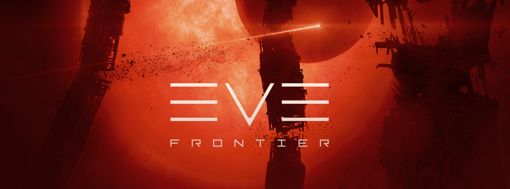

## Welcome to EVE Frontier Building!
Welcome, this repository contains guides and examples to get started building on EVE Frontier. For more information, you can visit https://docs.evefrontier.com/. 

To start building, follow the steps below to setup your local development tools and environment. If you already have the tools, make sure they are the correct version as otherwise you may have difficulties running the examples and building.

### Step 0: Installing general tools
Before you get started you need to either install, or make sure you have the required tools. This guide is for Linux, if you use a different OS then visit https://docs.evefrontier.com/Tools and follow the guide for your operating system.

#### Installing Git
Install Git through https://git-scm.com/book/en/v2/Getting-Started-Installing-Git. 

To confirm Git has been installed run:
```bash
git --version
```

#### Installing Node Version Manager
Install NVM by using this command:
```bash
curl -o- https://raw.githubusercontent.com/nvm-sh/nvm/v0.35.3/install.sh | bash
```

Restart the shell to use it.

#### Installing NPM
Install version 18 of NPM (Node.JS Version Manager) using NVM with:
```bash
nvm install 18
```

#### Installing PNPM
Install PNPM version 8, which is used as a more efficient version of NPM with:
```bash
npm install -g pnpm@latest-8
```

### Step 0.1: Installing Foundry + Forge
Install foundry and restart the shell with:
```bash
curl -L https://foundry.paradigm.xyz | bash && source /root/.bashrc
```

Run the below command to install forge, cast, anvil and chisel:
```bash
foundryup
```

### Step 0.2: Setting up your environment:
This guide will walk you through setting up a local environment for running a local Anvil node, deploying world contracts using Docker, and pulling ABIs.

### Prerequisites
Make sure you have the **Docker** installed on your system: [Installation Guide](https://docs.docker.com/get-docker/)

### Step 0.3: Deploying world contracts into a local node.
We have provided a docker compose file which bundles the running of the local node and deploying the world chain contracts to simulate the existing world. Run that with the command:
```bash
docker compose up -d
```


Monitor the progress of the world deployment with:

```bash
docker compose logs -f world-deployer
```

The deployment progress and relevant addresses will be displayed during the process. Once deployment is complete, you should see an output similar to the one below. Make sure to copy the world contract address and save it for future reference.


### Step 0.4 (Optional): Retrieving world ABIs
You can also retrieve the world abis and save them to the root directory from the deployment by running:

```bash
docker compose cp world-deployer:/monorepo/abis .
```

### Step 0.5: Start Building!

Now that your local tools and development environment is set up, you're ready to start building! To begin, simply navigate to the desired example directory (or use the links below) then follow the instructions outlined in its README file.

```bash
cd item-seller
cat readme.md
```

## Guides
### Smart Turret: [View](./smart-turret/readme.md)
Configure and deploy a Smart Turret smart contract, ready to be further developed.

### Item Seller: [View](./item-seller/readme.md)
Create a Smart Storage Unit (SSU) which can accept ERC20 tokens to transfer items to players.

### Smart Gate: [View](./smart-turret/readme.md)
Configure and deploy a Smart Gate smart contract, ready to be further developed.

### Vending Machine: [View](./vending-machine/readme.md)
Create a Vending Machine Smart Storage Unit (SSU) in the game which trade items between the owner and players.

### Gate Keeper: [View](./gate-keeper/readme.md)
Create a Smart Storage Unit (SSU) which can accept item donations toward a specific goal.