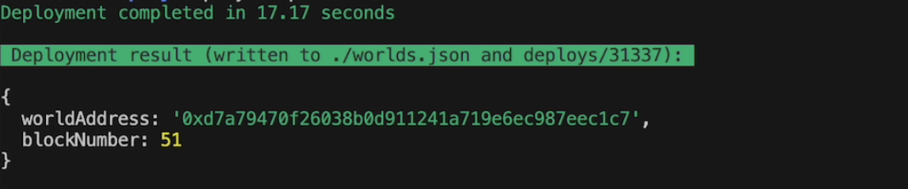

## Access Control (standard)
### Overview

This example utilizes a standard System pattern for acheiving access control on any function. It is a much simpler implementation that the Hook version, however it requires "hardcoding" access modifier into your other permissioned functions. If that is an acceptable trade-off then this version is for you!


Generally speaking the System pattern adheres to the following rules:
- deploy your MUD System and Table contracts as normal. In your System contracts you may inherit either the [Smart Object Framework EveSystem](https://github.com/projectawakening/world-chain-contracts/blob/develop/mud-contracts/smart-object-framework/src/systems/internal/EveSystem.sol) or the [MUD System](https://github.com/latticexyz/mud/blob/next.17/packages/world/src/System.sol). `EveSystem.sol` allows your functions to use the `hookable()` modifier.
- any functions you wish to add access control to MUST implement the access control modifier you wish to permission that function with 

We cover three account contexts that can be checked for permissions:
- `tx.origin` access control logic which checks the original transaction sender
- `world.initialMsgSender()` access control logic which checks the initial EVE World interactor
- `_msgsender()` access control logic which checks the MUD `_msgSender()` context, which is the same as `msg.sender` in normal contract patterns


## Example 
### AccessControl.sol
This is our access control logic contract that implements permission enforcements for the three account contexts via `modifier`. 

It also exposes a simple role setter function `setAccessListByRole()` which can configure Roles with a list of accounts that are on the access list for that Role. This function is only callable by the namespace owner (or anyone else the namespace owner grants access to).

### PermissionedSystem.sol
A dummy System contract which implements our modifier logic to enforce permissions. There is one function for each permission profile modifier we have implemented.

## Installing dependencies
For full MUD dependency installation see [here](https://mud.dev/quickstart#prerequisites)

If you don't already have Foundry on your system, navigate to the folder  (`/builder-examples/access-control-example/access-control-standard/packages/contracts/`)

and run the following:

```bash
pnpm run foundry:up
```

**NOTE:** For further details, Foundry installation documentation can be found [here](https://book.getfoundry.sh/getting-started/installation)

To install the project dependencies, navigate to the folder (`/builder-examples/access-control-example/access-control-standard/packages/contracts/`)

and run the following:

```bash
pnpm i
```

## Building the project

1.  Choose your namespace (only relevant for persistent deployments, won't affect in-memory test deployments):

If this is your first time deploying (or if you have made changes to a previously deployed Table, see notes below), you should change the `namespace` field in [mud.config.ts](./packages/contracts/mud.config.ts). However, if you have already setup your own namespace and you have only made System logic changes or NEW Tables, then you can re-deploy into the same namespace as before (assuming that your deployer account is also the same as the previous deployment).

**NOTE:** In the MUD Framework deploying new contracts is specific to a NAMESPACE for permissioning reasons. If you try to deploy to an existing namespace for which you are not the namespace owner, the deployment will fail.

**NOTE:** In the MUD Framework, System logic can be updated in the same namespace through the `deploy:evenet` script. However, Tables cannot be updated and must be re-registered into the world as NEW Tables when changed.

2. Build locally:

Navigate to the folder (`/builder-examples/access-control-example/access-control-standard/packages/contracts/`)

and run the following commands:

```bash
pnpm run clean
pnpm run build
```

## Testing
You can see the full suite of tests [here](./packages/contracts/test/AccessControlTest.t.sol)

Assuming you have successfully built the project (or re-built after any changes), to run the tests navigate to the folder `/builder-examples/access-control-example/access-control-standard/packages/contracts/`

and run the following command:

```bash
pnpm run test
```

## Running and Deploying

### Deploying on a persitent local chain with the EVE World chain Contracts 
Clone the World Chain Contracts repository [here](https://github.com/projectawakening/world-chain-contracts) and deploy a canonical EVE World contracts in your local:


```bash
git clone https://github.com/projectawakening/world-chain-contracts
cd world-chain-contracts
```  
 
1. To deploy all world contracts in local run the following from the root of the `world-chain-contracts` repository:

```bash
pnpm i
pnpm run dev
```

3. In your terminal UI, under the `./scripts/deploy-all.sh` process, wait a few seconds for all the contracts to compile and deploy. 

After the EVE World has been successfully deployed, obtain the world contract address from the terminal, or in the `worlds.json` file created in the root directory. 



4. Deploying and registering the access-control System and Table contracts to the Local persisted chain and registering them into the EVE World. Back in the `builder-examples`, navigate to the folder `/builder-examples/access-control-example/access-control-standard/packages/contracts/`

Deploy and register the contracts from this repository by replacing the EVE_WORLD_ADDRESS field with the address of the EVE World contract we just deployed, and run the following:

```bash
pnpm run deploy:local --worldAddress <EVE_WORLD_ADDRESS>
```

### Deploying on the live EVEnet testnet

The live EVEnet testnet has already had the EVE World and module contracts deployed. This means that when you are ready you will deploy only your custom Systems and Tables to the existing EVE World.

1. Be sure you have an account that is funded with EVEnet `GAS`.. we have a faucet, check the Builder Docs!

**NOTE**: The account you use for a fresh live deployment will become the namespace owner of the namespace you are registering your Systems and Tables on the EVE World (you can find your namespace in the [mud.config.ts](./packages/contracts/mud.config.ts) file).

**NOTE**: If you are tring to deploy to a namespace that is owned by another account on the live network your deployment will fail. Change the namespace in your `mud.config.ts` file and try again.

**NOTE**: You can deploy other Systems and Tables into the same namespace as long as you are running the `deploy:evenet` script with with correct namespace owner private key in the `.env` file. You can also upgrade Systems logic automatically via the `deploy:evenet` script by simply making changes to the System contract logic without changing its name or the namespace and then redeploying with `deploy:evenet`. The same is NOT true for Tables, any change to a Table requires deployment of a completely new Table and then data management between the old Table and the new Table in your System logic.

2. Navigate to the folder `/builder-examples/access-control-example/access-control-standard/packages/contracts/`

and run the following (on the EVEnet World):

```bash
pnpm run deploy:evenet --worldAddress "0x8dc9cab3e97da6df615a8a24cc07baf110d63071"
```

## Using Scripts to configure the project

There are several useful scripts included for configuring the access control example:

- GrantAccessRoleTableAccess - a script to grant an account access to the AccessRole table. This access will allow that account to call the `setAccessListByRole()` function to configure Role based access lists.
- ConfigureAdminAccessList - a script to configure which accounts are added to the ADMIN Role for ADMIN based permission checking. Accounts that are members of the ADMIN Role who make a call as the `tx.origin` of the transaction, will be allowed to call succefully, all others will be rejected
- ConfigureApprovedAccessList - a script to configure which contract addresses are added to the APPROVED Role for APPROVED based permission checking. Contracts that are members of the APPROVED Role who make a direct forwarded call as the `msg.sender` (or in the case of MUD the `_msgSender()`) of the transaction, will be allowed to call succefully, all forwarded or direct calls will be rejected

### GrantAccessRoleTableAccess 

#### To run the GrantAccessRoleTableAccess script on a local anvil deployment:

1. Add the EVE World `address` to the `WORLD_ADDRESS=` parameter under the `##LOCAL ENV` settings in your `.env` file. 

From the above `world-chain-contract` deployment process (either copied from the deployment terminal or from the `/world-chain-contracts/world.json`) add the EVE World contract address to your `.env` file located at `/builder-examples/access-control-example/access-control-standard/packages/contracts/.env`

2. In your `.env` file, uncomment the `# # GRANT ACCESS ROLE TABLE ACCESS` section, then add your desired account `address` to the paramter `TABLE_ACCESS_ACCOUNT=` (for testing we've added the forge anvil default deployer so they can have access in the example).

3. From the folder `/builder-examples/access-control-example/access-control-standard/packages/contracts/`

Run the following:

```bash
pnpm run grant-table-access
```

#### To run the GrantAccessRoleTableAccess script on the live EVEnet testnet:

1. Be sure you have an account that is funded with EVEnet `GAS`.. we have a faucet, check the Builder Docs!

2. Comment out the `##LOCAL ENV` section, and uncomment the `## EVENET ENV` section in your `.env` located at `/builder-examples/access-control-example/access-control-standard/packages/contracts/.env`. 

Add the hex string formatted private key of your funded deployment account to the `PRIVATE_KEY=` field.

**NOTE** for this grant access call to work, the account being used must be the owner of the namespace you have depoyed the AccessRole table to previously (likley the account you used to run the `deploy:evenet` script, unless you transferred ownership).

3. Follow steps 2 and 3 from the local instructions above.

### ConfigureAdminAccessList 

#### To run the ConfigureAdminAccessList script locally:

1. Be sure the `##LOCAL ENV` section is uncommented and the `## EVENET ENV` section is commented out. Add the EVE World `address` to the `WORLD_ADDRESS=` parameter under the `##LOCAL ENV` settings in your `.env` file. 

From the above `world-chain-contract` deployment process (either copied from the deployment terminal or from the `/world-chain-contracts/world.json`) add the EVE World contract address to your `.env` file located at `/builder-examples/access-control-example/access-control-standard/packages/contracts/.env`

2. In your `.env` file, uncomment the `# # CONFIGURE ADMIN ACCESS LIST` section, then add your desired account `address` to the paramter `ADMIN_ADDRESS_1=`. 

If you want to add additional ADMIN accounts to this role you can create and add more `ADMIN_ADDRESS_N` fields to this section. However, you must also adjust the `/builder-examples/access-control-example/access-control-standard/packages/contracts/scripts/ConfigureAdminAccessList.sol` script file to accept these new parameters. You can see a commented out example of this on L13,15,17.

3. From the folder `/builder-examples/access-control-example/access-control-standard/packages/contracts/`

Run the following:
```bash
pnpm run configure-admin-access-list
```

#### To run the ConfigureAdminAccessList script on the live EVEnet testnet:

1. Be sure you have an account that is funded with EVEnet `GAS`.. we have a faucet, check the Builder Docs!

2. Comment out the `##LOCAL ENV` section, and uncomment the `## EVENET ENV` section in your `.env` located at `/builder-examples/access-control-example/access-control-standard/packages/contracts/.env`. 

Add the hex string formatted private key of your funded access granted account to the `PRIVATE_KEY=` field.

**NOTE** for this configure admin call to work, the account being used must have been granted access to the AccessRole table by the owner of the namespace. See [here](./README.md#grantaccessroletableaccess) for AccessRole table granting.

3. Follow steps 2 and 3 from the local instructions above.

### ConfigureApprovedAccessList 

#### To run the ConfigureApprovedAccessList script locally:

1. Be sure the `##LOCAL ENV` section is uncommented and the `## EVENET ENV` section is commented out. Add the EVE World `address` to the `WORLD_ADDRESS=` parameter under the `##LOCAL ENV` settings in your `.env` file. 

From the above `world-chain-contract` deployment process (either copied from the deployment terminal or from the `/world-chain-contracts/world.json`) add the EVE World contract address to your `.env` file located at `/builder-examples/access-control-example/access-control-standard/packages/contracts/.env`

2. In your `.env` file, uncomment the `# # CONFIGURE APPROVED ACCESS LIST` section, then add your desired forwarding System ResourceId (as a bytes32 hex string) to the paramter `FORWARDER_SYSTEM_ADDR_1=`. We have pre-populated this field with the example ForwarderSystem value.

**NOTE**: to create a System ResourceID `bytes32` you should use the format:

`bytes32(<RESOURCE_SYSTEM> + <SYSTEM_NAMESPACE> + <SYSTEM_NAME>)`

In our example, for the `Forwarder` System this would be:

`bytes32(abi.encodePacked(bytes2("sy"), bytes14("access_control"), bytes16("ForwarderSystem")))`

If you want to add additional APPROVED forwarding Systems to this role you can create and add more `FORWARDER_SYSTEM_ID_N` fields to this section. However, you must also adjust the `/builder-examples/access-control-example/access-control-standard/packages/contracts/scripts/ConfigureApprovalAccessList.sol` script file to accept these new parameters. You can see a commented out example of this on L20,22,24,26,28.

3. From the folder `/builder-examples/access-control-example/access-control-standard/packages/contracts/`

Run the following:
```bash
pnpm run configure-approved-access-list
```

#### To run the ConfigureApprovedAccessList script on the live EVEnet testnet:

1. Be sure you have an account that is funded with EVEnet `GAS`.. we have a faucet, check the Builder Docs!

2. Comment out the `##LOCAL ENV` section, and uncomment the `## EVENET ENV` section in your `.env` located at `/builder-examples/access-control-example/access-control-standard/packages/contracts/.env`. 

Add the hex string formatted private key of your funded access granted account to the `PRIVATE_KEY=` field.

**NOTE** for this configure admin call to work, the account being used must have been granted access to the AccessRole table by the owner of the namespace. See [here](./README.md#grantaccessroletableaccess) for AccessRole table granting.

3. Follow steps 2 and 3 from the local instructions above.