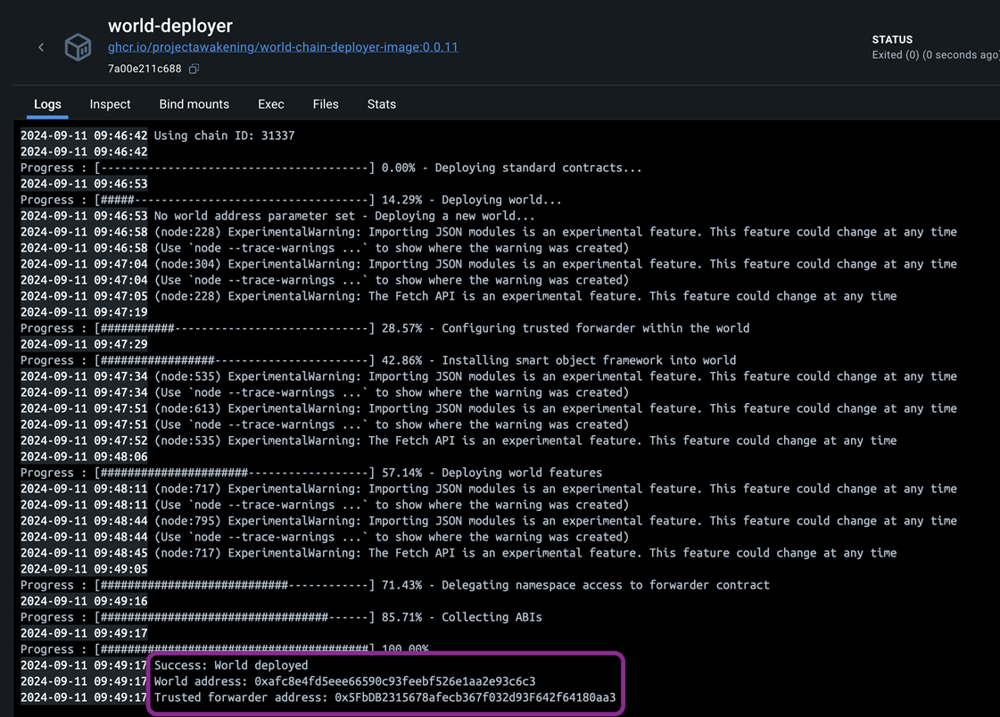
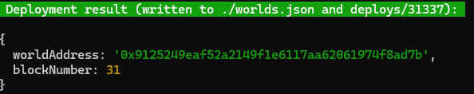

# Gate Keeper Example

## Introduction
This guide will walk you through the process of building contracts for the gate keeper, deploying them into an existing world running in Docker, and testing their functionality by executing scripts.

The gate keeper is a [Smart Storage Unit (SSU)](https://docs.evefrontier.com/SmartAssemblies/SmartStorageUnit) that allows you to crowdfund items toward a specific goal. For example, if you need a certain amount of resources to build a new ship for the corporation etc.

Previously, the gate keeper system was used to have shared goals for players to contribute salt items. Once the goals were met, gates and new areas were unlocked.

## Deployment and Testing
### Step 0: Deploy the gate keeper contracts to the existing world 
First, copy the World Contract Address from the Docker logs, then run the following command:



```bash
cd gate-keeper/packages/contracts
```

Install the dependencies for the contracts:
```bash
pnpm install
```

**Local Deployment**
This will deploy the contracts to your local world. Replace <worldAddress> with the world address from your Docker logs.
```bash
pnpm run deploy:local --worldAddress <worldAddress> 
```

**Devnet Deployment**
This will deploy the contracts to the Devnet world. You can retrieve the world address through https://blockchain-gateway-oblivion.nursery.reitnorf.com/config and then replace <worldAddress> with the world address. 
```bash
pnpm run deploy:devnet --worldAddress <worldAddress> 
```

eg: `pnpm run deploy:local --worldAddress 0xafc8e4fd5eee66590c93feebf526e1aa2e93c6c3`

Once the deployment is successful, you'll see a screen similar to the one below. This process deploys the Gate Keeper contract. <br>



### Step 1: Setup the environment variables 
Next, replace the following values in the [.env](./packages/contracts/.env) file with the values you copied earlier:

If you are on Devnet, then you can get your SSU_ID through 

```bash
#WORLD ADDRESS COPIED FROM DOCKER LOGS
WORLD_ADDRESS=

#DONT NEED TO CHANGE IF YOUR RUNNING LOCALLY
SSU_ID=
```

You can adjust the remaining values in the .env file as needed, though they are optional.


<details markdown="block">
<summary>Changing optional environment values</summary>

#### Setting item wanted and amount
You can set the item you want to crowdfund and the target amount.

```bash
#Item for the goal
INVENTORY_ITEM_ID=1135
#Quantity needed to reach the goal
TARGET_QUANTITY=10
```

</details>


### Step 2: Mock data for the existing world **(Local Development Only)**
To generate mock data for testing the Gate Keeper logic on the local world, run the following command:

```bash
pnpm run mock-data
```
This will create the on-chain SSU, fuel it and bring it online. This SSU will then act as a gate keeper, which has to be online to receive items for the set goal. 

### Step 3: Configure Gate Keeper 
To configure which items should be received and the target amount, run:

```bash
pnpm run configure-gate-keeper
```

You can adjust the values for the SSU_ID, INVENTORY_ITEM_ID & TARGET_QUANTITY in the .env file as needed, though they are optional.

### Step 4: Test Gate Keeper (Optional)
To test the gate keeper, execute the following command:

```bash
pnpm run deposit-to-ssu
```

### Troubleshooting

If you encounter any issues, refer to the troubleshooting tips below:

1. **World Address Mismatch**: Double-check that the `WORLD_ADDRESS` is correctly updated in the `contracts/.env` file. Make sure you are deploying contracts to the correct world.
   
2. **Anvil Instance Conflicts**: Ensure there is only one running instance of Anvil. The active instance should be initiated via the `docker compose up -d` command. Multiple instances of Anvil may cause unexpected behavior or deployment errors.

3. **Item Limits**: Be cautious not to attempt depositing more items than have been generated via the `mock-data` script. The number of available items is controlled by `MockSsuData.s.sol`, so ensure this script has been properly executed. The default number generated is 15, however you can change this as needed.