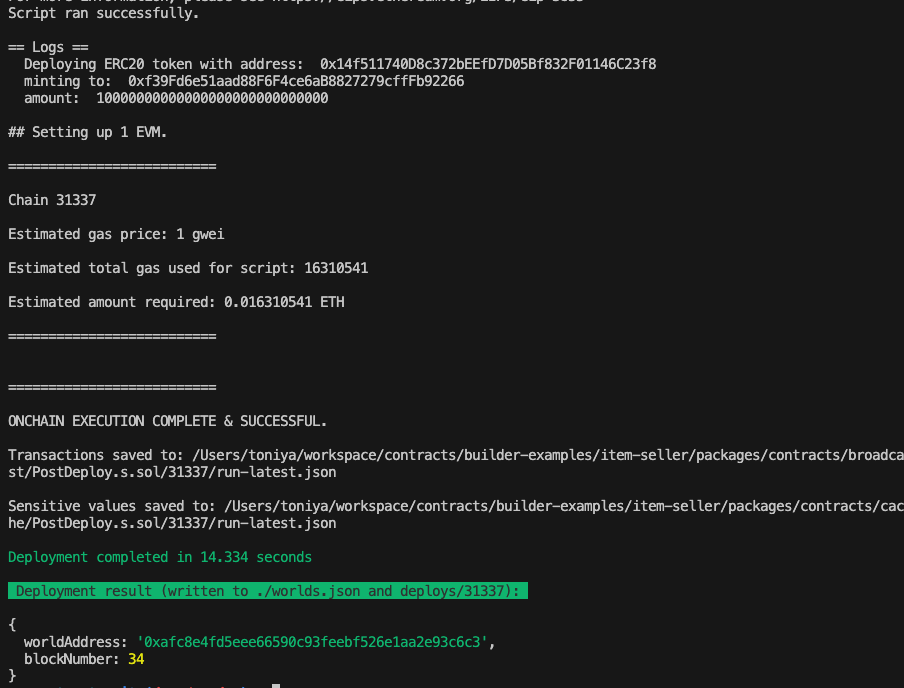
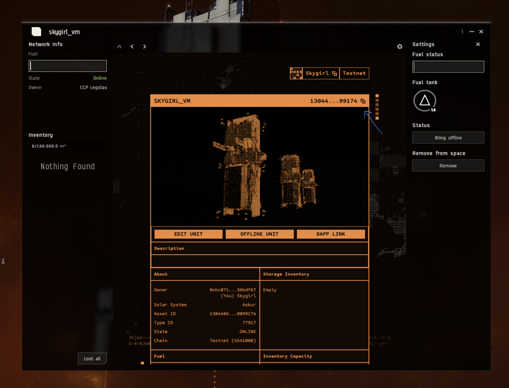
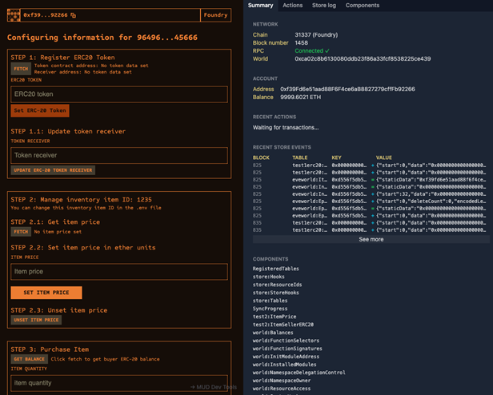

## Introduction
This guide will walk you through the process of building contracts for the item seller, deploying them into an existing world running in Docker, and testing their functionality by executing scripts. The contracts will be used with a SSU (Smart Storage Unit) to act as a item seller where players can purchase items, for example lenses for ERC20 Tokens.

### User Process
#### Step 0: User buys an item
The item seller will recieve the ERC20 token and authorize the transaction if the player has paid enough.

#### Step 1: Item Transfer
The item seller will transfer the item from the inventory to the ephemeral inventory. The ephemeral inventory is where players can input and withdraw items from the SSU. The inventory is where the owner of the SSU can store and withdraw items needed for the SSU such as the items being sold.

#### Step 2: Item Retrieval
The player will transfer the item from the SSU's ephemeral inventory to their ship. 

## Deployment and Testing
### Step 0: Deploy the item seller contracts to the existing world 
First, copy the World Contract Address from the Docker logs obtained in the previous step, then run the following command:


```bash
cd item-seller/packages/contracts
```

Install the dependecies for the contracts:
```bash
pnpm install
```

**Local Deployment**
This will deploy the contracts to your local world.
```bash
pnpm run deploy:local --worldAddress <worldAddress> 
```

**Devnet Deployment**
This will deploy the contracts to the Devnet world.
```bash
pnpm run deploy:devnet --worldAddress <worldAddress> 
```


eg: `pnpm run deploy:local --worldAddress 0xafc8e4fd5eee66590c93feebf526e1aa2e93c6c3`

Once the deployment is successful, you'll see a screen similar to the one below. This process deploys the Item Seller contract and a test ERC20 token required for the Item Seller. Be sure to copy the ERC20 token address and save it for future use.



### Step 1: Setup the environment variables 
Next, replace the following values in the [.env](./packages/contracts/.env) file with the values you copied earlier:

```bash
#WORLD ADDRESS COPIED FROM DOCKER LOGS
WORLD_ADDRESS=

#ERC20 TOKEN ADDRESS COPIED FROM ITEM SELLER DEPLOYMENT
ERC20_TOKEN_ADDRESS=

#DONT NEED TO CHANGE IF YOUR RUNNING LOCALLY
SSU_ID=
```

You can adjust the remaining values in the .env file as needed, though they are optional.


<details markdown="block">
<summary>Changing optional environment values</summary>

### Setting item, price and payment address
You can set the item you want to sell, the address that recieves payments and the price in Wei. 10^18 wei is equal to one Ether. For example, if one lens is 5 Tokens then the price is 5 * 10^18. This means that the default price is set to 0.5 Tokens.

```bash
##### ITEM SELLER CONFIGURATION
#ITEM ID 77800 - Common Ore
INVENTORY_ITEM_ID=1235

#The address that recieves the payments
RECEIVER_ADDRESS=0xf39Fd6e51aad88F6F4ce6aB8827279cffFb92266

##PRICE SHOULD BE IN WEI
PRICE_IN_WEI=500000000000000000
```

To get the INVENTORY_ITEM_ID you can follow these steps:

#### Step 0:
Right click your SSU, open the dapp window and copy the smart storage unit id.

> [!CAUTION]
> TODO: FINALIZE THIS SECTION.



#### Step 1:
Once you have your SSU ID, you can go to https://blockchain-gateway-test.nursery.reitnorf.com/smartdeployables/ssu_id (and replace ssu_id with your copied SSU ID). 

#### Step 2:
You should now have similar JSON to this. You want to get the item ID from the itemId in the storage items array and ephemeralInventoryItems array. The item ID should look something like: 

```json
"112603025077760770783264636189502217226733230421932850697496331082050661822826"
```

```json
"inventory": {
  "storageCapacity": 100000000000000,
  "usedCapacity": 490000000000,
  "storageItems": [
    {
      "typeId": 77518,
      "itemId": "112603025077760770783264636189502217226733230421932850697496331082050661822826",
      "quantity": 49,
      "name": "Lens 3X",
      "image": "https://devnet-data-ipfs-gateway.nursery.reitnorf.com/ipfs/QmcQzTvz9Z4koU8pvBJL94HxHtLoPoB9wDnuRE278AdbmA"
    }
  ],
  "ephemeralInventoryList": [
    {
      "ownerId": "0xbc07106cc909d37e36a1c3db35411805836bdf67",
      "ownerName": "skygirl",
      "storageCapacity": 1000000000000,
      "usedCapacity": 10000000000,
      "ephemeralInventoryItems": [
        {
          "typeId": 77518,
          "itemId": "112603025077760770783264636189502217226733230421932850697496331082050661822826",
          "quantity": 1,
          "name": "Lens 3X",
          "image": "https://devnet-data-ipfs-gateway.nursery.reitnorf.com/ipfs/QmcQzTvz9Z4koU8pvBJL94HxHtLoPoB9wDnuRE278AdbmA"
        }
      ]
    }
  ]
},
```

</details>


### Step 2: Mock data for the existing world 
To generate mock data for testing the Item Seller logic, run the following command:

```bash
pnpm run mock-data
```
This will create the on-chain SSU, fuel it, bring it online, and deposit some items into inventory so they can be sold in exchange for the ERC20 token.

### Step 3: Configure Item Seller 
To configure which items should be sold in return for the ERC20 token, run:

```bash
pnpm run configure-item-seller
```

You can adjust the values for the SSU_ID & INVENTORY_ITEM_ID in the .env file as needed, though they are optional.

### Step 4: Test Item Seller (Optional)
To test the purchase of an item in return for the token, execute the following command:

Note: In Devnet, ensure that the player has enough tokens to complete the purchase.

```bash
pnpm run purchase-item-with-token
```

## Client UI

### Step 5: Launch the Client UI

To start the client interface, navigate to the client directory and run the following command:

```bash
cd ../client
pnpm run dev
```

This will launch a local development server at `http://localhost:3000`, which will be connected to the world address defined earlier in Step 1.



### Step 6: Configure Client Environment Variables

Next, update the following values in the `.env` file located in the `./packages/client/` folder:

```bash
VITE_SMARTASSEMBLY_ID=
VITE_INVENTORY_ITEM_ID=
VITE_ERC20_TOKEN_ADDRESS=
```

These variables must be set as follows:

- **`VITE_SMARTASSEMBLY_ID`**: This should match the `SSU_ID` you set in `./packages/contracts/.env`.
- **`VITE_INVENTORY_ITEM_ID`**: This should match the `INVENTORY_ITEM_ID` from `./packages/contracts/.env`.
- **`VITE_ERC20_TOKEN_ADDRESS`**: Use the ERC20 token address from the contract deployment step.

By ensuring these values match those in the `contracts` folder, the client will correctly interface with the on-chain environment.

### Step 7: Running and Testing the Client

Once the client is running, you can interact with the system through the browser interface. This step allows you to simulate and test interactions like purchasing items, monitoring transactions, and observing live contract behavior.

---

### Troubleshooting

If you encounter any issues, refer to the troubleshooting tips below:

1. **World Address Mismatch**: Double-check that the `WORLD_ADDRESS` is correctly updated in the `contracts/.env` file. Make sure you are deploying contracts to the correct world.
   
2. **Anvil Instance Conflicts**: Ensure there is only one running instance of Anvil. The active instance should be initiated via the `docker compose up -d` command. Multiple instances of Anvil may cause unexpected behavior or deployment errors.

3. **Item Limits**: Be cautious not to attempt purchasing more items than have been generated via the `mock-data` script. The number of available items is controlled by `MockSsuData.s.sol`, so ensure this script has been properly executed.

4. **Environment Variable Consistency**: Confirm that the `VITE_SMARTASSEMBLY_ID` and `VITE_INVENTORY_ITEM_ID` in the client `.env` file match the values set up in `./packages/contracts/.env`. Misalignment between these variables can cause the client to fail when interacting with the contract.