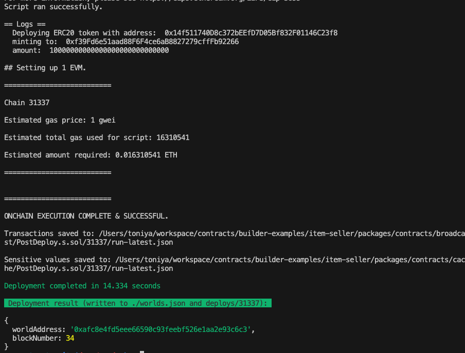

This guide will walk you through the process of building contracts, deploying them into an existing world running in Docker, and testing their functionality by executing scripts.

## Deployment and Testing
### Step 0: Deploy the item seller contracts to the existing world 
First, copy the World Contract Address from the Docker logs obtained in the previous step, then run the following command:


```bash
cd pakcages/contracts
```

**Local Deployment**
```bash
pnpm run deploy:local --worldAddress <worldAddress> 
```

**Devnet Deployment**
```bash
cd pakcages/contracts
pnpm run deploy:devnet --worldAddress <worldAddress> 
```


eg: `pnpm run deploy:local --worldAddress 0xafc8e4fd5eee66590c93feebf526e1aa2e93c6c3`

Once the deployment is successful, you'll see a screen similar to the one below. This process deploys the Item Seller contract and a test ERC20 token required for the Item Seller. Be sure to copy the ERC20 token address and save it for future use.



### Step 1: Setup the environment variables 
Next, replace the following values in the [.env](./packages/contracts/.env) file with the values you copied earlier:

```bash
#WORLD ADDRESS COPIED FROM DOCKER LOGS
WORLD_ADDRESS=

#ERC20 TOKEN ADDRESS COPIED FROM ITEM SELLER DEPLOYMENT
ERC20_TOKEN_ADDRESS=
```

You can adjust the remaining values in the .env file as needed, though they are optional.


### Step 2: Mock data for the existing world 
To generate mock data for testing the Item Seller logic, run the following command:

```bash
pnpm run mockData
```
This will create the on-chain SSU, fuel it, bring it online, and deposit some items into inventory so they can be sold in exchange for the ERC20 token.

### Step 3: Configure Item Seller 
To configure which items should be sold in return for the ERC20 token, run:

```bash
pnpm run configure-item-seller
```

You can adjust the values for the SSU_ID & INVENTORY_ITEM_ID in the .env file as needed, though they are optional.

### Step 4: Test Item Seller (Optional)
To test the purchase of an item in return for the token, execute the following command:

Note: In Devnet, ensure that the player has enough tokens to complete the purchase.

```bash
pnpm run purchase-item-with-token
```


