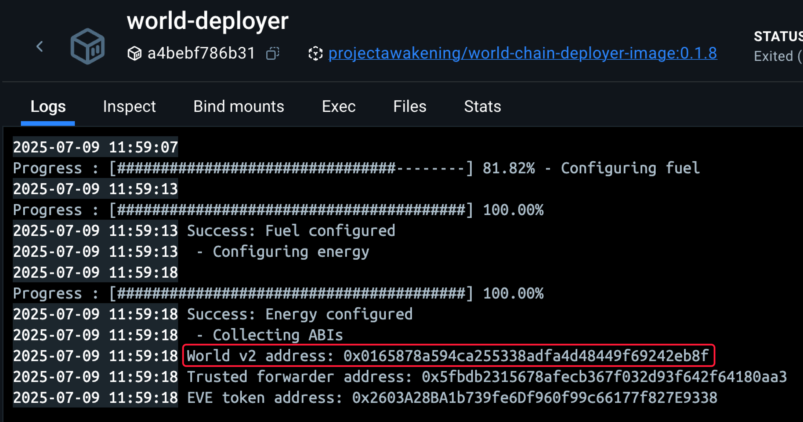
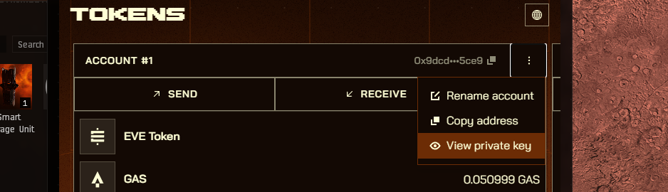
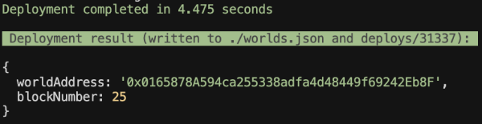

# Smart Storage Unit Example

## Table of Contents

1. [Introduction](#introduction)
2. [Deployment and Testing in Local Environment](#deployment-and-testing-in-local-environment)
3. [Deployment To The Game (Stillness)](#deployment-to-the-game-stillness)
4. [Configuring and Testing the Game Contracts (Stillness)](#configuring-and-testing-the-game-contracts-stillness)
5. [Troubleshooting](#troubleshooting)

## Introduction
This guide will walk you through the process of building contracts for a Smart Storage Unit, deploying them into an existing world running, and testing their functionality by executing scripts.

A Smart Storage Unit can be configured to trade items between the owner and other players. The amount traded is set by providing a ratio of items.

Before starting make sure you've installed all required tools from the main [README](../README.md)

You can test everything locally first using the [Local Environment Guide](#deployment-and-testing-in-local-environment), and when ready, deploy to the live game using the [Deployment Guide](#deployment-to-the-game-stillness).

### Additional Information

For additional details on the Smart Storage Unit, see our [Documentation](https://docs.evefrontier.com/SmartAssemblies/SmartStorageUnit).

## Deployment and Testing in Local Environment</a>
To deploy the example to your local world hosted on Docker, follow the below steps.

### Step 1: Deploy the example contracts to the existing world
First, copy the World Contract Address from the Docker logs obtained in the previous step:



Then, run the following commands:

1. Navigate to the example directory:
    ```bash
    cd smart-storage-unit
    ```

2. Install the Solidity dependencies for the contracts:
    ```bash
    pnpm install
    ```

3. Create your environment file:
    ```bash
    cp packages/contracts/.envsample packages/contracts/.env
    ```

4. Deploy to your local test environment
    ```bash
    pnpm dev
    ```

    > **Note:** This will deploy the contracts to a forked version of your local world for testing.

### Step 2: Setup the environment variables (Optional)
Next, update your [.env](./packages/contracts/.env) file with the trade ratio:

```bash
IN_RATIO=1
OUT_RATIO=2
```

> **Trading Ratio Example:**  
> With the above ratio (1:2), when a player deposits 1 item, they receive 2 items in return.
> 
> ⚠️ **Warning:** Choose your ratios carefully to avoid accidentally depleting your item supply!


### Step 3: Mock data for the existing world

Generate the test data by:

1. Select the "shell" process and then click on the main terminal window. 

    

2. To generate mock data for testing the SSU logic on the local world, run the following command. This generates and deploys the smart storage deployable and items.

    ```bash
    pnpm mock-data
    ```

> This will create the on-chain SSU, fuel it and bring it online.

### Step 4: Configure SSU
To configure which items should be traded and the ratio's to trade for run:

```bash
pnpm configure
```

> You can adjust the values for the SSU_ID, in and out item ID's and the ratios in the .env file as needed, though they are optional.

### Step 5: Test The SSU (Optional)
To test the SSU, execute the following command:

```bash
pnpm execute
```

> This will run a series of pre-developed tests to ensure the SSU is working as expected.

## Deployment to The Game (Stillness)
To deploy the example to the game server which is named Stillness, follow the below steps.

### Step 1: Setup your Environment
Move to the example directory with:

```bash
cd smart-storage-unit/packages/contracts
```

Then install the Solidity dependencies for the contracts:
```bash
pnpm install
```

Then, if you haven't already copy the .envsample file to a .env file with:
```bash
cp .envsample .env
```

### Step 2: Configure the Example to use Stillness

Next, set the following values in the [.env](./packages/contracts/.env) file to point the contracts to use Stillness:
- WORLD_ADDRESS=0x7fe660995b0c59b6975d5d59973e2668af6bb9c5
- RPC_URL=https://garnet-rpc.live.tech.evefrontier.com
- CHAIN_ID=17069

You can also automatically point to Stillness with the most up-to-date values using: 

```bash
pnpm env-stillness
```

### Step 3: Configure the Namespace

Change the namespace from test to your own custom namespace. This will be the namespace that you use for future development with the example or other smart contracts. For example, you could use your username as the namespace. Once you deploy to a namespace, it will set you as the owner and only you will be able to deploy smart contracts within the namespace. Namespaces can only contain a-z, A-Z, 0-9 and _.

First, edit **packages/contracts/mud.config.ts** to include your new namespace

```ts
import { defineWorld } from "@latticexyz/world";

export default defineWorld({
    namespace: "test",
    tables: {
        ...
```

Then, edit **packages/contracts/src/systems/constants.sol** to replace the DEPLOYMENT_NAMESPACE with your namespace:

```solidity
pragma solidity >=0.8.21;

// make sure this matches mud.config.ts namespace
bytes14 constant DEPLOYMENT_NAMESPACE = "test";

bytes16 constant SYSTEM_NAME = "SmartStorageUnit";
```

You can also use the below command and then input your new namespace to change it automatically:

```bash
pnpm set-namespace
```

### Step 4: Configure the Private Key

Now replace the private key in the [.env](./packages/contracts/.env) file. Get your recovery phrase from the game wallet, import into EVE Wallet and then retrieve the private key as visible in the image below.



```bash
PRIVATE_KEY=0xac0974bec39a17e36ba4a6b4d238ff944bacb478cbed5efcae784d7bf4f2ff80
```

You can also use the below command and then input your private key to change it:

```bash
pnpm set-key
```

### Step 5: Deploy the Contract

Then deploy the contract using:

```bash
pnpm deploy:garnet
```

Once the deployment is successful, you'll see a screen similar to the one below. This process deploys the SSU contract. 



## Configuring and Testing the Game Contracts (Stillness)

### Step 1: Setup the environment variables 
Next, replace the following values in the [.env](./packages/contracts/.env) file with the below steps.

#### 1. Player Test Account

Now set the test player private key. This will be used for the execute script, and so set it to the private key of the player account that you want to trade with. You can also skip this variable for now if you want.

```bash
TEST_PLAYER_PRIVATE_KEY=0xac0974bec39a17e36ba4a6b4d238ff944bacb478cbed5efcae784d7bf4f2ff80
```

> ⚠️ Note: This is only for testing, and an example not requiring this is on it's way.

#### 2. Smart Storage Unit ID (SSU ID)

For Stillness, the Smart Storage Unit ID (SSU ID) is available once you have deployed an SSU in the game.

1. Right click your Smart Storage Unit and press Interact

2. Copy the smart storage unit id.

    

3. Set the SSU_ID in the .env file.

    ```bash
    SSU_ID=34818344039668088032259299209624217066809194721387714788472158182502870248994
    ```

#### 3. Item ID's

To retrieve the Item ID's you can use https://blockchain-gateway-stillness.live.tech.evefrontier.com/types and then search for the item name.

You can use the "smartItemId" as the Item ID.

**Example Response:**

```json
"83839": {
    "name": "Salt",
    "smartItemId": "70505200487489129491533272716910408603753256595363780714882065332876101173161"
}
```


Configure the Item ID's in the .env file.

```bash
#ITEM IN : SALT
ITEM_IN_ID=70505200487489129491533272716910408603753256595363780714882065332876101173161
#ITEM OUT : LENS
ITEM_OUT_ID=112603025077760770783264636189502217226733230421932850697496331082050661822826
```

#### 4. Ratios

A ratio with the in being 1 and out being 2 means that for every item a player puts into the deployable, they get two items from it. 

```bash
#IN Ratio
IN_RATIO=1
#OUT Ratio
OUT_RATIO=2
```

> ⚠️ Note: Be careful not to accidentally give away your whole supply of items with the wrong ratio.

---

You can also set these values automatically using the below command:

```bash
pnpm set-config
```

### Step 2: Configure SSU
To configure which items should be traded and the ratio's to trade for run:

```bash
pnpm configure
```

> You can adjust the values for the SSU_ID, in and out item ID's and the ratios in the .env file as needed.

### Step 3: Execute the trade
To trade items, make sure the items are in the inventories and then you need to run:

```bash
pnpm execute
```

### Troubleshooting

If you encounter any issues, refer to the troubleshooting tips below:

1. **World Address Mismatch**: Double-check that the `WORLD_ADDRESS` is correctly updated in the `contracts/.env` file. Make sure you are deploying contracts to the correct world.
   
2. **Anvil Instance Conflicts**: Ensure there is only one running instance of Anvil. The active instance should be initiated via the `docker compose up -d` command. Multiple instances of Anvil may cause unexpected behavior or deployment errors.

3. **Trade Quantity Is Incorrect**: Ensure your input and output ratios have been correctly set in the `contracts/.env` file.  

## Need Help? 

If you are still having issues, then visit the Documentation or join the Discord Community for support.

[](https://docs.evefrontier.com/)
[](https://discord.gg/evefrontier)