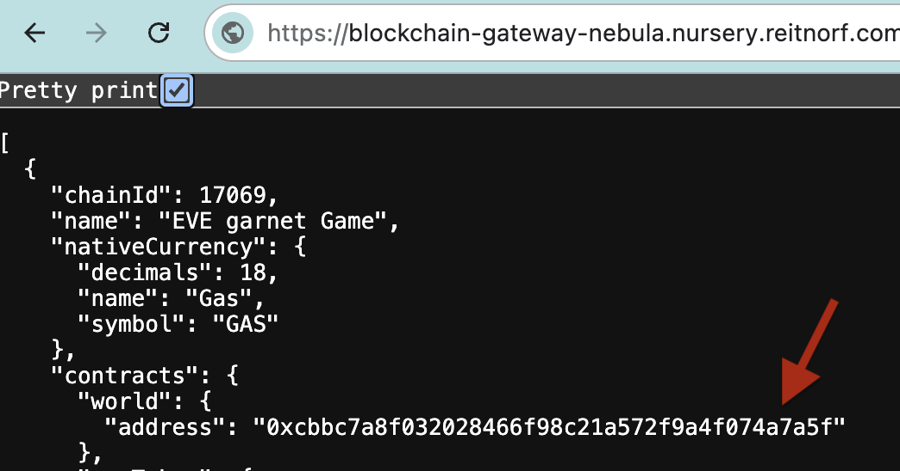
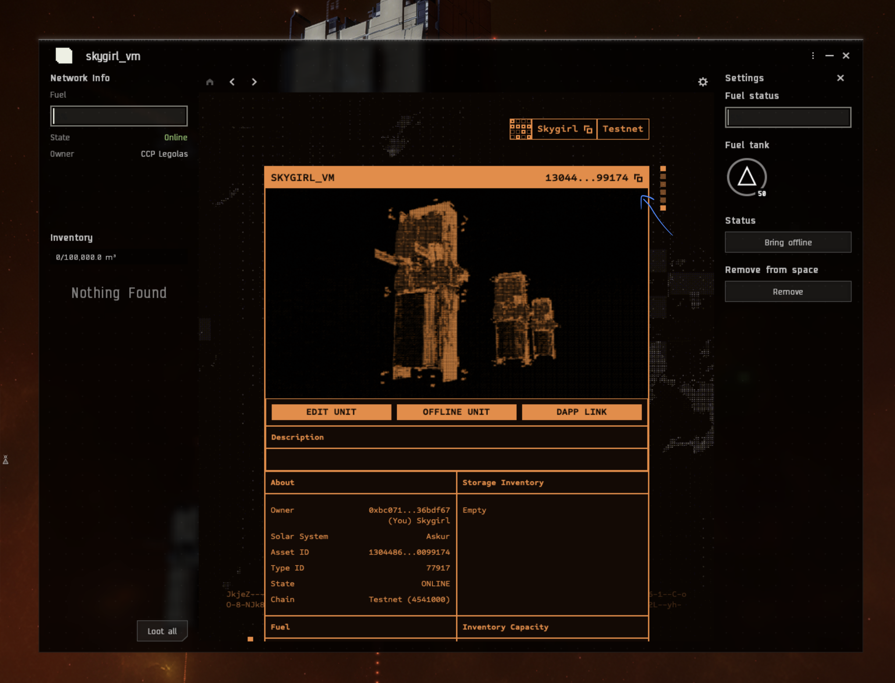
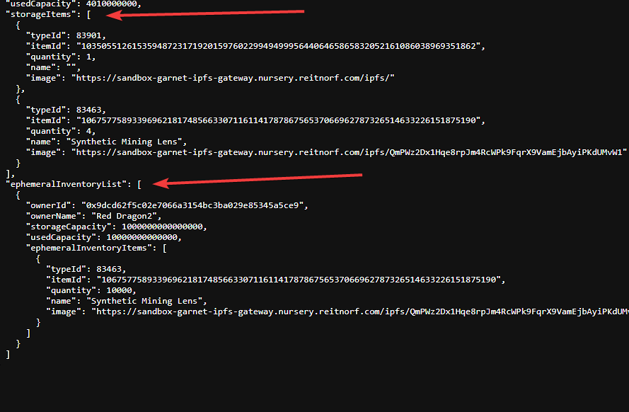

# Vending Machine Example

## Introduction
This guide will walk you through the process of building contracts for the vending machine, deploying them into an existing world running in Docker, and testing their functionality by executing scripts.

A vending machine is a SSU (Smart Storage Unit) in the game which can be setup to automatically trade items between the owner and other players. Prices are set by providing a ratio of items. For example with a ratio of 1:2 you can exchange 1 ore for 2 mining crystals

### Additional Information

For additional information on the Smart Storage Unit you can visit: [https://docs.evefrontier.com/SmartAssemblies/SmartStorageUnit](https://docs.evefrontier.com/SmartAssemblies/SmartStorageUnit).

## Deployment and Testing
### Step 0: Deploy the vending machine contracts to the existing world 
First, copy the World Contract Address from the Docker logs obtained in the previous step, then run the following command:


```bash
cd vending-machine/packages/contracts
```

Install the Solidity dependencies for the contracts:
```bash
pnpm install
```

**Local Deployment**
This will deploy the contracts to your local world.
```bash
pnpm deploy:local --worldAddress <worldAddress> 
```
**Devnet/Production Deployment**
To deploy in devenet or production you can retrieve the world address through the below links and then replace <worldAddress> with the world address. 

Devnet which connects to Nova - Builder Sandbox

https://blockchain-gateway-nova.nursery.reitnorf.com/config

```bash
pnpm run deploy:garnet --worldAddress <worldAddress> 
```

Production which connects to Nebula

https://blockchain-gateway-nebula.nursery.reitnorf.com/config 

eg: `pnpm deploy:local --worldAddress 0xafc8e4fd5eee66590c93feebf526e1aa2e93c6c3`

Once the deployment is successful, you'll see a screen similar to the one below. This process deploys the Vending Machine contract. 


### Step 1: Setup the environment variables 
Next, replace the following values in the [.env](./packages/contracts/.env) file with the respective values 

You can change values in the .env file for Nova and Nebula, though they are optional for local testing.

For Nova and Nebula, Get your recovery phrase from the game wallet, import into EVE Wallet and then grab the private key from there.

```bash
PRIVATE_KEY=0xac0974bec39a17e36ba4a6b4d238ff944bacb478cbed5efcae784d7bf4f2ff80
```

For Nova and Nebula, get the world address from the configs. You can deploy your own ERC20 token or use the EVE Token address in the config

https://blockchain-gateway-nova.nursery.reitnorf.com/config
https://blockchain-gateway-nebula.nursery.reitnorf.com/config



```bash
#WORLD ADDRESS COPIED FROM DOCKER LOGS FOR LOCAL
WORLD_ADDRESS=
```

For Nova or Nebula, Smart Storage Unit ID (SSU ID) is available once you have deployed an SSU in the game.

Right click your Smart Storage Unit, and open the dapp window and copy the smart storage unit id.



```bash
#DONT NEED TO CHANGE IF YOUR RUNNING LOCALLY
SSU_ID=34818344039668088032259299209624217066809194721387714788472158182502870248994
```

For Nova or Nebula, You can get the item you want to sell and the item you want to buy from the world api by using the below links and replace the `ssu_id` by your own SSU_ID.

NOTE: Its a prerequisite to have already deposited these items into the SSU. This is to ensure that the game logic has updated those specific items data on-chain.

https://blockchain-gateway-nebula.nursery.reitnorf.com/smartassemblies/<ssu_id>
https://blockchain-gateway-nova.nursery.reitnorf.com/smartassemblies/<ssu_id>

You should now have similar JSON to this. You want to get the item ID from the itemId in the storage items array and ephemeralInventoryItems array. The item ID should look something like: 

```json
"112603025077760770783264636189502217226733230421932850697496331082050661822826"
```

```json
"inventory": {
  "storageCapacity": 100000000000000,
  "usedCapacity": 490000000000,
  "storageItems": [
    {
      "typeId": 77518,
      "itemId": "112603025077760770783264636189502217226733230421932850697496331082050661822826",
      "quantity": 49,
      "name": "Lens 3X",
      "image": "https://devnet-data-ipfs-gateway.nursery.reitnorf.com/ipfs/QmcQzTvz9Z4koU8pvBJL94HxHtLoPoB9wDnuRE278AdbmA"
    }
  ],
  "ephemeralInventoryList": [
    {
      "ownerId": "0xbc07106cc909d37e36a1c3db35411805836bdf67",
      "ownerName": "skygirl",
      "storageCapacity": 1000000000000,
      "usedCapacity": 10000000000,
      "ephemeralInventoryItems": [
        {
          "typeId": 77518,
          "itemId": "112603025077760770783264636189502217226733230421932850697496331082050661822826",
          "quantity": 1,
          "name": "Lens 3X",
          "image": "https://devnet-data-ipfs-gateway.nursery.reitnorf.com/ipfs/QmcQzTvz9Z4koU8pvBJL94HxHtLoPoB9wDnuRE278AdbmA"
        }
      ]
    }
  ]
},
```

Fetch the `itemId` from `{inventory.storageItems.itemId}`



```bash
#ITEM IN : SALT
ITEM_IN_ID=70505200487489129491533272716910408603753256595363780714882065332876101173161
#ITEM OUT : LENS
ITEM_OUT_ID=112603025077760770783264636189502217226733230421932850697496331082050661822826
```

```bash
#ITEM ID 77800 - Common Ore
ITEM_IN_ID=888
#ITEM ID 77811 - Carbonaceous Ore
ITEM_OUT_ID=999
```

A ratio with the in being 1 and out being 2 means that for every item a player puts into the deployable, they get two items from it. 

You can alter this ratio how you want, but be careful not to accidentally give away your whole supply of items with the wrong ratio.

```bash
#IN Ratio
IN_RATIO=1
#OUT Ratio
OUT_RATIO=2
```

### Step 2: Mock data for the existing world **(Local Development Only)**
To generate mock data for testing the Vending Machine logic on the local world, run the following command. This generates and deploys the smart storage deployable and items.

```bash
pnpm mock-data
```

This will create the on-chain SSU, fuel it and bring it online.

### Step 3: Configure Vending Machine
To configure which items should be traded and the ratio's to trade for run:

```bash
pnpm configure-ratio
```

You can adjust the values for the SSU_ID, in and out item ID's and the ratios in the .env file as needed, though they are optional.

### Step 4: Test The Vending Machine (Optional)
To test the vending machine, execute the following command:

```bash
pnpm execute
```

### Troubleshooting

If you encounter any issues, refer to the troubleshooting tips below:

1. **World Address Mismatch**: Double-check that the `WORLD_ADDRESS` is correctly updated in the `contracts/.env` file. Make sure you are deploying contracts to the correct world.
   
2. **Anvil Instance Conflicts**: Ensure there is only one running instance of Anvil. The active instance should be initiated via the `docker compose up -d` command. Multiple instances of Anvil may cause unexpected behavior or deployment errors.

3. **Trade Quantity Is Incorrect**: Ensure your input and output ratios have been correctly set in the `contracts/.env` file.  

### Still having issues?
If you are still having issues, then visit [the documentation website](https://docs.evefrontier.com/Troubleshooting) for more general troubleshooting tips.