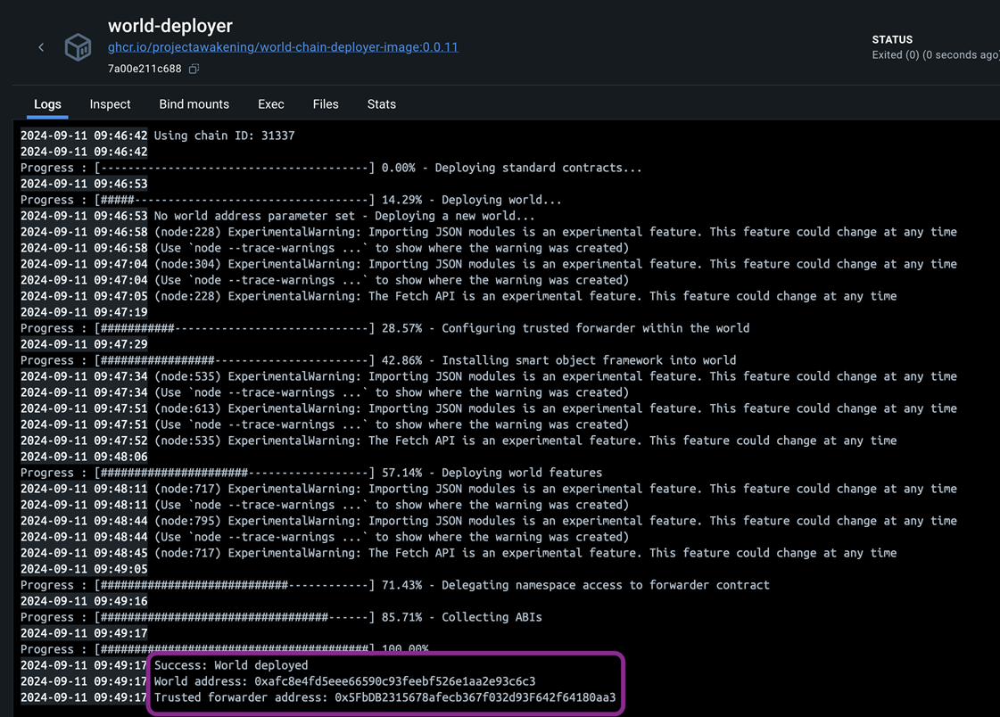

## Introduction
This guide will walk you through the process of building contracts for the vending machine, deploying them into an existing world running in Docker, and testing their functionality by executing scripts.

A vending machine is a SSU in the game which can be setup to trade items between the owner and players. Prices are set by providing a ratio of items. For example with a ratio of 1:2  you can exchange 1 ore for 2 mining crystals

## Deployment and Testing
### Step 0: Deploy the vending machine contracts to the existing world 
First, copy the World Contract Address from the Docker logs obtained in the previous step, then run the following command:



```bash
cd vending-machine/packages/contracts
```

Install the dependecies for the contracts:
```bash
pnpm install
```

**Local Deployment**
This will deploy the contracts to your local world.
```bash
pnpm run deploy:local --worldAddress <worldAddress> 
```

**Devnet Deployment**
This will deploy the contracts to the Devnet world.
```bash
cd packages/contracts
pnpm run deploy:devnet --worldAddress <worldAddress> 
```


eg: `pnpm run deploy:local --worldAddress 0xafc8e4fd5eee66590c93feebf526e1aa2e93c6c3`

Once the deployment is successful, you'll see a screen similar to the one below. This process deploys the Vending Machine contract.


### Step 1: Setup the environment variables 
Next, replace the following values in the [.env](./packages/contracts/.env) file with the values you copied earlier:

```bash
#WORLD ADDRESS COPIED FROM DOCKER LOGS
WORLD_ADDRESS=

#DONT NEED TO CHANGE IF YOUR RUNNING LOCALLY
SSU_ID=
```

You can adjust the remaining values in the .env file as needed, though they are optional.

<details markdown="block">
<summary>Customizing optional environment values</summary>

#### Items
You can set the items in and out to change which items you trade for. 

```bash
#ITEM ID 77800 - Common Ore
ITEM_IN_ID=888
#ITEM ID 77811 - Carbonaceous Ore
ITEM_OUT_ID=999
```

#### Ratios
A ratio with the in being 1 and out being 2 means that for every item a player puts into the deployable, they get two items from it. 

You can alter this ratio how you want, but be careful not to accidently give away your whole supply of items with the wrong ratio.

```bash
#IN Ratio
IN_RATIO=1
#OUT Ratio
OUT_RATIO=2
```

</details>


### Step 2: Mock data for the existing world 
To generate mock data for testing the Vending Machine logic, run the following command. This generates and deploys the smart storage deployable and items.

```bash
pnpm run mock-data
```
This will create the on-chain SSU, fuel it and bring it online.

### Step 3: Configure Vending Machine
To configure which items should be traded and the ratio's to trade for run:

```bash
pnpm run configure-ratio
```

You can adjust the values for the SSU_ID, in and out item ID's and the ratios in the .env file as needed, though they are optional.

### Step 4: Test The Vending Machine (Optional)
To test the vending machine, execute the following command:

```bash
pnpm run execute
```

### Troubleshooting

If you encounter any issues, refer to the troubleshooting tips below:

1. **World Address Mismatch**: Double-check that the `WORLD_ADDRESS` is correctly updated in the `contracts/.env` file. Make sure you are deploying contracts to the correct world.
   
2. **Anvil Instance Conflicts**: Ensure there is only one running instance of Anvil. The active instance should be initiated via the `docker compose up -d` command. Multiple instances of Anvil may cause unexpected behavior or deployment errors.

3. **Trade Quantity Is Incorrect**: Ensure your input and output ratios have been correctly set in the `contracts/.env` file.  